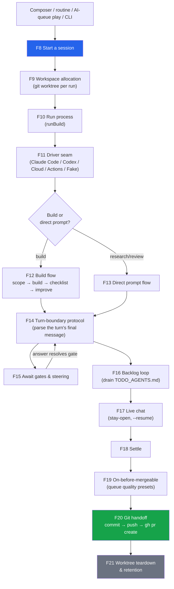

# Business logic: every high-level flow in this codebase

The catalogue of what this repo *does*, end to end. One entry per flow: what starts it, what
happens, where the code is. It complements the two documents already here rather than repeating
them — [`Architecture.md`](./Architecture.md) says how the packages are layered and *why*,
[`FEATURES.md`](./FEATURES.md) walks two flows (branch/commit/push/PR, and starting a session)
line by line. This one is the breadth pass: all of them, at altitude.

Anchors are `path:line` at the time of writing; treat them as entry points, not addresses.

## The four layers

| Layer | Package(s) | What it owns |
|---|---|---|
| **Product** | `@gemstack/the-framework` | The whole autonomous-programming product: CLI, daemon, run lifecycle, git handoff, autonomy loops, chat/notification surfaces. Drives a coding-agent CLI as a black box. |
| **Dashboard** | `@gemstack/framework-dashboard` | The localhost UI. A pure projection of the `.the-framework/` files the daemon writes, over Telefunc. |
| **Orchestration engines** | `@gemstack/ai-autopilot`, `@gemstack/ai-sdk`, `@gemstack/ai-skills`, `@gemstack/ai-mcp` | Framework-agnostic AI engines: the single-agent loop, multi-agent supervision, the bootstrap spine, skills, the MCP bridge. |
| **MCP** | `@gemstack/mcp`, `@gemstack/mcp-connectors`, `@gemstack/mcp-connector-*` | Authoring MCP servers, and the connector contract for wiring external services into them. |

The product layer sits on the engines: `the-framework` reuses ai-autopilot's `Bootstrap` spine and
loop, and adds the two pieces autopilot has no opinion about — the **driver seam** (wrap a coding
agent CLI) and the **product shell** (CLI + daemon + dashboard).

The one invariant that shapes almost everything below: **files are the seam.** A run appends to
`.the-framework/events.jsonl`; the daemon tails it and pushes to browsers. Steering flows back
through `.the-framework/control.jsonl`, which the run tails. There is no run↔daemon IPC.

---

# Part 1 — The product (`@gemstack/the-framework`)

## 1. Setup and activation

### F1. Install / activate a repo
**Trigger:** `Add project` in the dashboard, `framework` in a fresh repo, or the repos-directory opt-in.
**Flow:** commit any pre-existing dirty state so the install commit is clean → create the
`.the-framework/` marker directory → seed `LOGS.md` → teach `.gitignore` which parts stay untracked
→ register the project in the user's global registry.
`install.ts`, `project.ts`, `registry.ts`, `dashboard-rpc/projects.telefunc.ts`.

### F2. The project registry
**Flow:** one JSON file in the user's home (`~/.the-framework.json`, `.bashrc`-style — per machine,
not synced) holds every registered project *and* the user's dashboard preferences *and* the daemon
token and Discord credentials. Preferences resolve in tiers: project overrides user, and only for the
keys a project is allowed to override.
`registry.ts:1`, `preference-defaults.ts`, `discord-credentials-store.ts`.

### F3. Repos-directory auto-registration
**Trigger:** daemon boot, when the opt-in is set.
**Flow:** scan one directory for direct-child git repos, register each.
`repos-directory.ts`, `daemon.ts:106`.

### F4. Preflight / `framework doctor`
**Flow:** probe the agent CLI the run actually picked (`claude` vs `codex`) before spawning anything,
so a missing prerequisite fails early and clearly instead of mid-run. Also prints which flags the
picked agent *cannot* honor (e.g. `--max-cost` against an agent that reports no price) rather than
letting a flag imply a guard that is not in force.
`preflight.ts`, `cli.ts:734` (`unguardedNotices`), `update-check.ts` (npm freshness footer).

## 2. The daemon

### F5. Daemon lifecycle
**Trigger:** `framework` (foreground), `framework --daemon` (detached), `framework stop`.
**Flow:** one daemon per machine, liveness in a single global state file next to the registry, so
`framework` in any repo finds the same daemon. On boot: generate + persist a shared token if the bind
is non-loopback (a daemon that spawns processes on a reachable port is RCE), ensure `.the-framework/`
exists, register the home project, scan the repos directory, **reconcile orphans** (any run still
marked `running` by a dead process is settled to `stopped`), start the per-project runtime, serve the
prerendered dashboard bundle, start background services. Heartbeat keeps the state file fresh.
`daemon.ts:346` (`runDaemon`), `:261` (`ensureDaemon`), `:304` (`stopDaemon`), `:209` (heartbeat).

### F6. Background services
Everything the daemon runs beside serving the UI, each gated the same way (an env var says *where*, a
preference says *whether*, re-read per tick so a toggle needs no restart): the two Discord notification
watchers, the auto-PM sweep, the conversation committer, the Discord chatbot and its reply mirror.
`daemon-services.ts:1`.

### F7. Request guard and routing
Loopback binds are protected by the same-origin check on `/_telefunc`; non-loopback binds demand the
shared token (`?token=` 302 for browsers, cookie for daemon-to-daemon). Request paths are parsed
defensively — an absolute-form target used to throw synchronously and take the daemon down.
`dashboard/server.ts`, `request-path.ts`.

## 3. Starting and running a session

The run lifecycle end to end — one session, from trigger to teardown:

### F8. Start a session
**Trigger:** the composer (launcher or in-session), a routine's `Run now`, an AI-queue row's play
button, the onboarding checklist, or the CLI.
**Flow (daemon side, `daemon-runtime.ts:746` `onStart`):** remote device? → relay it (F30). Topic run?
→ scratch dir that re-homes later. Otherwise resolve the project in the registry → allocate the
workspace → busy guard → translate options into CLI flags → spawn the agent process **detached** with
stderr to `.the-framework/stderr.log` → install exit handlers (failed-start marker, teardown, transient
retry).
`daemon-runtime.ts:378` (`createProjectRuntime`), `:239` (`startOptionFlags`), `dashboard-rpc/control.telefunc.ts`.

### F9. Workspace allocation (git worktrees)
**Flow:** every run gets its own git worktree under `.the-framework/worktrees/<runId>`, on branch
`the-framework/run-<runId>`, so N concurrent runs never fight over the working tree and the user's own
checkout — uncommitted work included — is never touched. `node_modules` is gitignored, so the parent
checkout's dependency trees are **symlinked** in (instant, no extra disk) and the links are excluded.
A non-git project falls back to the main checkout (and to one run at a time); a git project whose
`worktree add` *failed* does **not** fall back — the run fails, because a failed run is recoverable and
a checkout with agent edits mixed into it is not.
`store/worktree.ts`, `store/worktree-deps.ts`, `daemon-runtime.ts:457`.

### F10. The run process, in order
**Flow (`cli.ts:1285` `runBuild`):** merge flags over `the-framework.yml` → preflight → write `run.json`
+ `events.jsonl` → emit the opening events (handoff-armed, ticket, queue entry, branch) → decide
attended vs unattended → start tailing the control channel → pick the driver for the run's *target* →
start the consumption guard → compose the system prompt → run the flow (F12 or F13) → settle (F17).
`cli.ts:1218` (`runCli` dispatch table), `config-layers.ts`, `run-options.ts`.

### F11. The driver seam
The one abstraction a coding-agent CLI is wrapped behind: `start` a session, `prompt` it, read the
code, `dispose`. The seam is deliberately **the code and the outcome**, never the agent's individual
tool calls — we prompt, let the agent's own loop run to completion, then verify by result.
Implementations: `ClaudeCodeDriver` (`claude -p` stream-json), `CodexDriver` (own sandbox policy),
`CloudDriver` (hands off to a claude.ai session over a pty), `ActionsDriver` (dispatches a GitHub
Actions workflow, polls it, reads the uploaded transcript), `FakeDriver` (deterministic, offline).
A **process-tree kill registry** spawns each child as its own process-group leader and signals the whole
group, so an interrupted run cannot orphan a subtree of node workers, ripgrep and MCP servers.
`driver/types.ts`, `driver/claude-code.ts`, `driver/codex.ts`, `driver/cloud.ts`, `driver/actions.ts`,
`driver/fake.ts`, `driver/child-registry.ts`, `run-driver.ts`.

### F12. The build flow
**Flow (`run.ts:277` `runFramework`):** detect the project's framework (narration only — nothing about
it reaches the prompt) → compose the system channel → **scope → build → production-grade checklist →
improve**, repeating the checklist/improve pass until its `{ blockers }` verdict is empty or `maxPasses`
stops it → the backlog loop (F16) → optional app preview → the chat phase (F15). The checklist can be
composed with a **serve check** that actually boots the app and confirms it serves, so a pass must both
read production-grade and actually run. A hands-off driver (cloud) drops every phase after build: the
work is happening somewhere else and there is nothing to read back.
`run.ts`, `steps.ts`, `ai-autopilot` `bootstrap/`.

### F13. The direct prompt / research flow
One prompt through the driver, honouring its await gates — no scope/build scaffolding, no review loop.
This is what review-shaped presets need: operate on existing code, stop at a choice, continue from the
answer. `prompt-run.ts:1`.

### F14. The turn-boundary protocol
The driver runs each turn as a black box, so everything the framework learns from a turn it learns by
parsing the turn's final message. Parsed blocks: `set-session-name`, `ready-for-merge`,
`show-markdown` (agent views), `await-choices` / `await-multiselect` (blocking gates), `await-browser`
(hand the browser to a human), `await-bind-project` (topic runs). The protocol strings are appended to
the system prompt at runtime, beside the drift-guarded base prompt.
`turn-gate.ts:1`, `prompts/protocols/*.md`.

### F15. Await gates and steering
**Flow:** the agent emits a gate block and stops → the run emits a `choice` event and parks → the
dashboard renders the rail → the human picks → the daemon appends a `ControlEntry` to that run's
`control.jsonl` → the run's tail resolves the parked gate and prompts the agent with the answer. Stop
clicks travel the same channel. Unattended runs disable gates entirely (nobody is there to answer).
`await-gate.ts:73` (`resolveAwaitGate`), `:342` (`runAwaitRounds`), `control.ts`, `jsonl-tail.ts`.

### F16. The backlog loop
Once the main work settles, consume the agent's own `TODO_AGENTS.md` backlog one entry per turn until
it is empty: read the file, gate ("start the next item?") when someone can answer, prompt the agent to
complete exactly one entry and check it off, repeat. Autopilot auto-accepts the gate, so the whole
backlog drains unattended; autopilot off pauses before each entry.
`todo-loop.ts:348` (`runTodoLoop`), `:143` (`insertTodoEntry`, priority-aware).

### F17. Live chat with a running session
The reverse of an await gate: the user speaking unprompted. Each message continues the *same* agent
session (`claude --resume <id>`) so context is kept. The run drains the message channel between turns
and, when the agent goes idle, waits there for the next one — the "stay-open" lifecycle. A headless run
gets no message channel and simply ends when the agent stops.
`run-messages.ts`, `await-gate.ts:305` (`runChatPhase`).

### F18. Settle
**Flow (`cli.ts:888` `settleRun`), strictly ordered:** the on-before-mergeable hook (F19) → the auto
handoff (F20) → finish `LOGS.md` → `store.close()` (which archives the log into `runs/`). The order is
load-bearing: anything appended after the close misses the copy the dashboard's history reads.
Cleanup in `finally`: control channel, consumption guard, browser stream, relay flush.

### F19. On-before-mergeable
One agent turn that **queues** the quality presets rather than running them: it appends
"Apply `<preset>` …" entries to the session's TODO file for the backlog loop to pick up, and asks the
agent to fold what it learned back into the business-knowledge docs.
`on-before-mergeable-prompt.ts`, `prompts/on_before_mergeable_prompt.md`.

### F20. The git handoff (commit → push → PR)
**Flow:** on the success path only (a user-stopped run skips it), decide whether the run is *empty* —
zero commits, or every changed file under `.the-framework/`. Empty runs are never published. Otherwise
commit any pending work to the run's branch, `pushRunBranch`, then `gh pr create`. No PR number is ever
stored: every surface re-resolves it live from the branch record, preferring an open PR and accepting a
closed one only if it was created after the run started.
`dashboard/run-handoff.ts:534` (`runAutoHandoff`), `:375`, `:438`, `:154` (`resolveRunPr`), `dashboard/gh.ts`.

### F21. Worktree teardown and retention
**Trigger:** the run process exits.
**Flow:** stop the session's own preview → record the branch (it outlives the worktree) → archive the
run's history into the repo (otherwise removing the checkout would delete the session from history) →
then the retention rule: a run that finished **cleanly** has its uncommitted work committed and its
worktree removed; a run that **failed or was stopped keeps its checkout**, because that is exactly when
you want to see the half-finished tree. Best-effort throughout — a worktree that cannot be retired is
left on disk, which is the safe direction.
`daemon-runtime.ts:489`, `worktrees.ts`, `merged-worktrees.ts`, `stale-branch.ts`.

### F22. Continue a run / transient retry
`--continue-run` re-attaches a run to its own checkout: the retained worktree if it exists, else its
recorded branch checked out fresh, with the archived history restored so the session reopens as one row
rather than starting empty. A child that died on a driver-level transient error (connection drop, 5xx,
rate limit) is retried with backoff by continuing the same run in the same worktree before being
declared failed.
`daemon-runtime.ts:414` (`continueWorkspace`), `:201` (`isTransientRunFailure`), `store/run-checkout.ts`, `store/suspend.ts`.

## 4. Autonomy

### F23. The AI queue (`TODO_AGENTS.md`)
The durable, global queue of what AI works on next, priority-ordered. Written directly by sessions
(unlike a *ticket*, which is a proposal for a human to accept).
`todo-loop.ts`, `dashboard/queue.ts`, `prompts/todo_format.md`.

### F24. Queue promotion
Runs happen in a worktree, which is right for code and wrong for shared mutable state: a run that
writes a good queue writes it onto a branch nobody reads, so the sweep keeps re-deriving the same
entries forever and spending real quota. So the **daemon** (not the agent, which stays sandboxed)
copies that one known file into the project checkout and commits only that pathspec. Conservative
everywhere it is not certain: anything unexpected skips with a reason and leaves the checkout untouched.
`queue-promote.ts:61` (`promoteQueue`).

### F25. Queue claims
An entry stays claimed while its run is live or its PR is open, so two drains never double-assign it.
A failed/stopped run or a closed PR releases it.
`queue-promote.ts:232` (`claimedQueueEntries`).

### F26. Auto PM — the idle sweep
**Trigger:** a daemon tick with nobody at the keyboard.
**Policy (`auto-pm.ts:112` `autoPmDecision`), cheapest check first:** is the feature on? → is the
concurrency cap reached? → was a run started for this project a moment ago (cooldown)? → is the queue
readable? → is there quota headroom (F28)? Then the queue picks the job: a **non-empty queue drains**
(one pinned entry per run, so parallel drains work on disjoint things), an **empty queue refills** by
rotating through triage-quick → triage-consensual → spike-and-plan. The calendar-paced **maintenance
sweep** sits outside the rotation and takes precedence when due. Every refusal is phrased as a reason,
named precisely enough that a setting does not read as a bug.
`auto-pm.ts:476` (`startAutoPm`), `AUTO_PM_ROUTINES`.

### F27. Maintenance sweep (`framework maintain`)
Walk the registered repos, find the commits each has grown since its last maintenance review (state in a
gitignored `.the-framework/maintenance.json`), and run the maintainability loop on them.
`maintenance.ts`, `cli.ts:2095`.

## 5. Spending limits

### F28. The quota boundary
The whole policy is one line: the boundary is the **pro-rated share of the week's allowance that has
elapsed**, rising continuously with the clock. Nothing to configure — it is derived from the account's
own week, which the agent reports. Two properties fall out: nothing is left on the floor (the boundary
reaches the full allowance exactly as the week resets, so a quiet week still gets spent), and
low-priority work cannot starve high-priority work (user-requested work borrows against days still to
come; unattended work stands down past the boundary, with a configurable cushion).
`quota-boundary.ts`, `dashboard/quota.ts`.

### F29. Quota polling and the consumption guard
A quota read spawns the whole agent CLI (~5s) and is refused upstream if asked too often, so the poller
is deliberately slow — the boundary moves over days. The consumption guard is the live gate inside a
run: it polls, and trips the run's abort controller when the boundary is crossed. A per-run USD budget
cap (`--max-cost`) aborts the same way.
`quota-poller.ts`, `consumption-guard.ts`, `usage.ts`, `run-telemetry.ts`.

## 6. Surfaces and channels

### F30. Remote runs on a connected device
**Flow:** the local daemon holds the saved device's token, so *it* — not the browser — drives the remote
daemon: POST the run to the remote's `/_relay/start`, then fetch-stream the remote's `/_relay/events`
back into a local event stream the dashboard reads over its normal same-origin channel. Run-scoped RPCs
(read / diff / steer / handoff / push / PR) are forwarded over `/_relay/rpc`; an unreachable device
answers with the same empty shape a failed local read gives, so no caller special-cases a remote run.
The browser never talks cross-origin and the token never leaves the two daemons.
`dashboard/remote-run.ts`, `dashboard/relay-endpoints.ts`, `dashboard-rpc/relay-run.ts`, `dashboard-rpc/devices.telefunc.ts`.

### F31. The hosted relay (`framework relay`)
Ingest a run's event stream over HTTP and re-serve the same dashboard to N remote browsers keyed by run
id, so two people on different machines watch one run live. The dashboard opens in read-only watch mode;
only the live stream is exposed (an empty projects provider makes the file-backed RPCs return nothing).
Deliberately unauthenticated: anyone with the URL can watch. A run publishes to it with `--share`.
`relay.ts:1`.

### F32. Cloud and GitHub Actions targets
`--run-on web` hands the task to a real Claude Code cloud session (the CLI's own `--cloud` under a pty,
because `--cloud` refuses a piped stdout); it does its own worktree and opens its own PR, at 0% local
CPU, with **no read-back API** of any kind — so the turn resolves at session creation and the run ends
with the link. `--run-on actions` dispatches the official Claude Code action, polls the workflow, and
reads the transcript it uploads; continuity between turns is the branch the previous turn pushed.
`driver/cloud.ts`, `driver/actions.ts`, `driver/actions-zip.ts`.

### F33. The browser bridge
An extension running inside the user's own Claude session posts to one token-guarded daemon route, so a
question a *cloud* run is parked on becomes a card in the dashboard; the picked answer travels back
(`queued` → `sent`/`failed`) for the extension to deliver into the composer. Deliberately tiny payload —
no path, command, prompt or free text — so the worst a stolen token buys is a bogus question card. No
CORS headers on purpose.
`dashboard/bridge-endpoints.ts`, `dashboard/bridge-store.ts`, `dashboard/bridge-sessions.ts`.

### F34. The run's browser
The run launches Chrome itself with a debug port and hands the MCP browser server a `--browserUrl`, so
the agent and a watching human can attach as two CDP clients at once. The run serves the latest
screencast frame as MJPEG (an `` renders it natively — no client library, no new dependency) and
takes clicks/keys back over POST. The dashboard cannot reach that bridge directly (different origin), so
the daemon proxies it, and the run's port is never named by the client — it comes from the run's meta,
which is what stops the proxy being an open relay into anything else on loopback.
`browser.ts`, `browser-stream.ts`, `dashboard/browser-proxy.ts`, `prompts/protocols/browser.md`.

### F35. Hand the browser to a human
An `await-browser` gate parks the run on a login wall, captcha, SSO or 2FA step — the agent never types
a password and never attempts a captcha. The human acts in the streamed browser (F34) and the run
resumes from their answer.

### F36. App preview
The decoupled twin of the serve gate: where that boots the app to *verify* it, this boots it to *show*
it. One click, in the daemon process: the project's dev script when it has one, else a built-in static
server. A session can preview its own worktree; the preview is stopped before that worktree is torn down.
`preview.ts`, `preview-runtime.ts`, `dashboard/content-type.ts`.

### F37. Discord notifications (outbound)
Two watchers on a poll — **activity** (runs that finished) and **interventions** (what needs a human) —
each keyed so only *new* items notify, each posting one clamped message to a webhook. A failed delivery
never throws out of a daemon watcher. While notifications are off the cursor still advances without
posting, so turning them on starts from now instead of flushing a backlog.
`dashboard/activity.ts`, `dashboard/interventions.ts:81`, `dashboard/keyed-watcher.ts`, `dashboard/keys.ts`, `dashboard/discord-webhook.ts`.

### F38. The Discord chatbot (inbound)
A hand-rolled gateway client (identify / heartbeat / resume / message events over the global
`WebSocket`) feeds pure routing rules: what should this message do given a snapshot of the project's
state? Answering a parked gate needs its options, which live in the run's event log, so the snapshot
reads them through the store. The action is applied over the control channel — so a chat message reaches
a run exactly the way a dashboard click does, and the run commits it to the conversation.
`discord/gateway.ts`, `discord/routing.ts`, `discord/bot.ts`, `discord/live-run.ts`, `discord/rest.ts`.
**Known MVP limit:** chat models one live run per project and always routes to the newest.

### F39. Reply mirror (outbound half of chat)
Send a session's answers back to the channel that asked. The source is the **committed conversation**,
not the event log — a conversation turn is the settled text a person actually read. The channel is a
recorded `runId → channelId` binding, not a guess, and the baseline is taken at bind time so no backlog
is replayed into a channel.
`discord/reply-mirror.ts`.

## 7. What gets written to git

### F40. Conversations
The human turns and the agent's replies of a run, committed into the repo so a clone carries the chat
and not just the fact a run happened. Deliberately not the verbose tool-call transcript (the model
provider owns that) — what lands is what a person would reread. One file per run, because run worktrees
are live concurrently and a shared file would conflict every time two runs chatted at once.
`conversations.ts`.

### F41. The conversation committer
A run's worktree sweeps its own conversation on teardown; the **main checkout** has no such path, so the
daemon debounces on an idle window (a commit per chat turn would bury the project's real history) and
commits a path-scoped batch — never `git add -A`, so the user's in-progress work cannot ride along and
their index is left alone. A locked index or a rebase in progress means somebody else is mid-operation:
skip and retry next window.
`conversation-commit.ts:1`.

### F42. Committed session history
Run state lives in `.the-framework/runs/`, which install-time `.gitignore` keeps untracked — so
`git clean -fdx`, an ordinary thing to do, used to delete every session a project ever ran. Finished runs
are therefore archived to `.the-framework/<user>/sessions/`, scoped per user (via the git `user.email`
already configured) so two people on one repo sit side by side instead of conflicting on every merge.
`sessions.ts`, `store/run-store.ts`, `logs.ts` (`LOGS.md`, the human-readable project log).

### F43. Tickets
`tickets/<DATE>_<SLUG>.md` — a plain repo convention, not a proprietary directory: the human-facing
roadmap. Optional `.spike.md` (how hard, which ways, estimated effort) and `.plan.md` (the detailed
plan, hard problems, variability) siblings. Parsing is deliberately tolerant, because tickets predating
the format (GitHub imports) must still list. `tickets/meta.json` records the last GitHub import.
`tickets.ts`, `dashboard/tickets.ts`, `prompts/ticketing_format.md`.

### F44. The event store
Persisting *is* durably logging the event stream: the dashboard is a pure projection of it, so a
restarted dashboard rehydrates by replaying the append-only log into a fresh stream — there is no
separate state model to keep in sync. The agent's own chat transcript is explicitly not persisted.
`store/run-store.ts:1`, `jsonl-tail.ts`, `events.ts`.

## 8. Prompts and presets

### F45. System-prompt composition
One assembly path shared by the build and direct-prompt flows so the two cannot drift: the built-in
`prompts/system_prompt.md` (the agent's protocol — analyze the prompt, name the session, branch, measure
variability, offer alternatives, signal ready-for-merge), plus the runtime protocol appends (await,
signal, hands-off, browser, topic-bind), plus the user's own `SYSTEM.md`, plus the picked context
directories. The exact composed text is emitted as an event so the dashboard can show precisely what the
agent runs under. The Node-bound file read is split out so the pure composition can render in the browser.
`system-prompt.ts`, `system-prompt-file.ts`, `prompt-template.ts` (the `${{ … }}` fragment layer — real JS
via `new Function`, so **only trusted templates are ever rendered**), `steps.ts`.

### F46. Presets
Every preset is one row in one table (`preset-catalog.ts`); the prompt text ships as prose in
`prompts/presets/<stem>.md` and reaches the table through generated constants. Presets are pure (no
`node:*`) so the dashboard renders any of them in the browser. Custom presets save to two tiers: the
**user** tier (home file, follows the person, stays private) and the **project** tier (in the repo,
travels with the code, shared with everyone who clones).
`preset-catalog.ts`, `presets.ts`, `preset-registry.ts`, `preset-prompt.ts`, `project-presets.ts`.

### F47. Domain presets and modes
A per-repo `the-framework.yml` records which Open Loop domain preset and which modes a project builds
under, so config travels with the code instead of being retyped as flags. Layers resolve nearest-wins
(a layer that left a key unset does not participate), which is what lets a project override only what it
sets — impossible on the `||` chain this replaced.
`config.ts`, `config-layers.ts`.

---

# Part 2 — The dashboard (`@gemstack/framework-dashboard`)

A Vike + React + shadcn + Telefunc SPA, prerendered and served by the daemon. Every read is a projection
of the same `.the-framework/` files; every write is a Telefunc call into the daemon's own closures.

### F48. Routing is the selection
`/` = Overview, `/{projectId}` = project home, `/{projectId}/{sessionId}` = one session. This replaced
three pieces of reconciled React state that repeatedly disagreed about which run was in play — a route
cannot disagree with itself, and a session becomes a link you can paste, reload and bookmark.
`pages/index/+Page.tsx`, `lib/use-route.ts`.

### F49. Overview
Usage first (the one figure that governs everything the agent may do next), then the **Human Queue**
(what needs you), the **agents working now**, the **AI Queue** (every project's open `TODO_AGENTS.md`
entries, in full — a collapsed plan is one you cannot read), the **routine work** card, and hot tickets
across every project. Polled, so it stays live.
`components/DashboardPage.tsx`, `AiQueue.tsx`, `RoutineWork.tsx`, `HotTickets.tsx`, `Agents.tsx`, `Quota.tsx`.

### F50. Onboarding checklist
Each step's "done" is derived from a real fact — a registered project, a non-empty queue, a ticket on
disk, a granted browser permission, a daemon holding Discord credentials — so a step cannot be ticked by
clicking it, and a step done outside the dashboard shows up ticked anyway.
`components/OnboardingChecklist.tsx`.

### F51. The composer
Typed prompt (attended, kind `build`), preset picker `/` (unattended, kind `prompt`), context picker `#`,
agent/model, run-on (this machine / Actions / web / a saved device), and the tri-state option rows that
become `--[no-]` flags. In-session composers hide what was baked at spawn; a new session starts fresh, a
live one sends a message, an ended one continues.
`components/Composer.tsx`, `StartRunForm.tsx`, `RunComposer.tsx`, `lib/run-option-rows.ts`, `OptionsMenu.tsx`, `ContextMenu.tsx`, `PresetsMenu.tsx`.

### F52. The session view
Live feed, agent views rail, choices rail, changed files + diffs, git status bar, run overview and
outcomes, the handoff panel (push / open PR), the actions menu (stop, serve, remove worktree), the
browser panel, and the docs/log right rail.
`components/RunView.tsx`, `RunFeed.tsx`, `ChoicesRail.tsx`, `ViewsRail.tsx`, `RunChanges.tsx`, `DiffView.tsx`, `RunHandoff.tsx`, `SessionActionsMenu.tsx`, `BrowserPanel.tsx`, `RightRail.tsx`.

### F53. Live data
Events stream over a Telefunc Channel bound to *that run's own* log inside its worktree; everything else
polls. Slow reads (notably `gh pr view`, ~600ms against a git read's ~10ms) go through a read-through
cache that single-flights concurrent asks, serves stale while revalidating, and budgets the cold ask —
reporting `pending` (not "failed") so a caller that must not act on a half-answer can hold off.
`dashboard-rpc/events.telefunc.ts`, `dashboard-rpc/stream-channel.ts`, `dashboard/cache.ts`, `lib/use-live-events.ts`, `lib/use-async.ts`.

### F54. Tickets pages, settings, watch mode
Ticket list and ticket detail (with a Queue button that promotes a ticket into the AI queue), the
settings page (preferences, devices, Discord credentials, presets, onboarding), and the read-only relay
watch view.
`components/TicketsPage.tsx`, `TicketDetailPage.tsx`, `SettingsPage.tsx`, `DevicesSettings.tsx`, `BridgeSettings.tsx`, `RelayView.tsx`.

---

# Part 3 — Orchestration engine (`@gemstack/ai-autopilot`)

### F55. Bootstrap
The spine from nothing to a running, production-grade app: **scope → build → full-fledged loop**. Scope is
the one and only interrogation (prototype vs full, plus intent); build runs inside a runner, streaming
narration and interruptible via `AbortSignal`; the loop repeats the production-grade checklist with fresh
context, improving against its `{ blockers }` verdict until it is empty or `maxPasses` stops it. Steps are
injected, so a test drives the whole flow with stubs and a fake runner.
`bootstrap/`.

### F56. Supervisor
**plan → dispatch → synthesize.** A planner decomposes the task; the supervisor dispatches subtasks to
worker agents with bounded concurrency, an optional token budget and per-subtask error isolation; a
synthesizer combines the results. It owns the control *policy* over many runs — which agents run, in what
order, how results combine, when to stop. `supervisor.ts`, `planner.ts`, `synthesizer.ts`, `pool.ts`.

### F57. The loop
The agent declares a semantic `LoopEvent` ("major change", "new UI flow"); a `Loop` maps that kind to an
ordered chain of prompts; the engine runs each for N fresh-context passes and consults the decisions
ledger along the way. Semantic, not command-driven and not run-on-every-PR. `loop/`.

### F58. The verdict convention
A prompt ends its output with a fenced `json` block holding `{ "blockers": [...] }`. Empty means passing;
non-empty is the concrete work still required. This is what lets the loop gate on *what a review
concluded* rather than merely on whether the prompt ran. `loop/verdict.ts`.

### F59. Decisions ledger
Record settled choices and rejected ideas with their reasons, round-tripped to a human-editable
`DECISIONS.md`, so a run stops re-pitching what was already turned down. Consult before proposing, append
on accept/reject; exposed to an agent as tools plus a briefing prepended to prompt instructions.
`decisions/`.

### F60. Scale mode (`CODE-OVERVIEW.md`)
An always-current map the agent reads first in a large repo. The hard part is keeping it current — a stale
overview is worse than none — so refresh is triggered by a deterministic **material-change** detector
(build/config change, test tooling change, directory restructure, a large multi-file change), wired into
the loop rather than run on every edit. `overview/`.

### F61. Framework detection
Score a project's dependencies and files against framework presets (deps weigh more than files); a new
framework is a new preset, not a runtime fork. `framework-detection/`.

### F62. Domain presets
`{loops, prompts}` as one selectable, composable bundle — authored in code or loaded from a directory of
`.md` files, with mode variants selected by frontmatter conditions (most-specific eligible sibling wins),
and composable so presets-of-presets falls out. `preset/`, `prompts/`.

### F63. The runner seam
A pluggable workspace (filesystem + shell + optional preview) where autopilot builds and runs an app:
`FakeRunner` (in-memory), `LocalRunner` (host), `DockerRunner` (container), `WebContainerRunner`
(in-browser, needs cross-origin isolation), plus `runnerTools` to expose a booted session to an agent.
`runner/`.

### F64. Serve check
Boot the app the build wrote — install, optionally build, start the dev server, wait for the port, fetch a
health path — and turn any failure into a concrete `{ blockers }` verdict. A runner that cannot start
background processes skips (a passing verdict with a note) rather than blocking forever.
`bootstrap/serve-check.ts`.

### F65. Deploy
Decide SSR/SSG/SPA plus a target, narrate the plan, hand it to a `DeployTarget` adapter (Cloudflare,
Dokploy, plan-only, fake). Deciding is bootstrap's job; executing is the target's.
`bootstrap/deploy.ts`, `cloudflare.ts`, `dokploy.ts`.

### F66. Surfaces
Run the same autopilot in a terminal (`terminalSink`), an in-page UI, or a background process
(`launchAutopilot`), all over one replayable multi-consumer `EventStream` with history replay from an
offset. `surface/`.

---

# Part 4 — The agent engine (`@gemstack/ai-sdk`)

### F67. The agent loop
`Agent` declares model, instructions, tools, middleware and stop conditions; `prompt()` / `stream()` run
the loop: prepare the step, call the provider, execute tool calls, feed results back, repeat until a stop
condition fires or `maxSteps` is reached. Hooks at each seam: `prepareStep`, `onIteration`, middleware
`onConfig`, observers, and model failover recorded in the loop context. `agent.ts`, `middleware.ts`.

### F68. Providers
One `ProviderAdapter` contract behind a registry that resolves `'<provider>/<model>'` strings, with
failover across candidates. Anthropic, OpenAI, Google, Azure, Bedrock, Ollama, DeepSeek, xAI, Groq,
Mistral, Cohere, OpenRouter, plus embedding/rerank/voice specialists (Voyage, Jina, ElevenLabs) and a
generic OpenAI-compatible adapter. `providers/`, `registry.ts`, `gateway/` (template for normalizing a
gateway's own auth + SSE envelope behind the same contract).

### F69. Tools
`toolDefinition` / `dynamicTool` / `ToolBuilder`, Zod → JSON Schema, **scoped tools** (collapse a
discriminated union of capability branches into one flat call schema), **handoffs** (transfer control to
another agent), **client tools** (pause the run, resolve in the browser, resume), and **approval gates**
(pause for a human decision on a risky call). `tool.ts`, `scoped-tool.ts`, `handoff.ts`,
`resume-approval.ts`, `provider-tools.ts`.

### F70. Structured output, streaming, attachments
Schema-validated output with retry on mismatch; token/chunk streaming with SSE transport; images,
documents and audio as message content parts. `output.ts`, `agent-sse.ts`, `attachment.ts`, `files.ts`.

### F71. Memory and conversation
Per-user memory (extract facts from a turn, inject relevant ones into the next), conversation stores with
persistence, sanitization and continuation validation, plus run stores for the agent and its sub-agents.
`memory.ts`, `memory-extract.ts`, `memory-inject.ts`, `conversation.ts`, `conversation-persistence.ts`, `agent-run-store.ts`, `sub-agent-run-store.ts`.

### F72. Retrieval
`fileSearch` (hosted vector stores — emitted as the provider's native block where supported, with a local
fallback) and `similaritySearch` (embed the query, vector-search an ORM model's column, return top-K).
Plus caching for embeddings. `file-search.ts`, `similarity-search.ts`, `rerank.ts`, `cached-embedding.ts`.

### F73. Budget and queueing
Per-period USD caps enforced around runs, pricing tables per model, and durable queue jobs that stream
progress. `budget/`, `queue-job.ts`, `queue-adapter.ts`.

### F74. Eval
Define a suite of input cases plus assertions (`exactMatch`, `regex`, `llmJudge`, `jsonShape`,
`semanticMatch`, `tokenCost`, composable), run them against the very same `Agent` instances the app uses,
report pass/fail with cost and tokens (console, JSON, HTML). `eval/`.

### F75. Computer use
An action vocabulary plus a Playwright executor, wired to the provider's native computer-use tool block so
an agent can drive a real browser. `computer-use/`.

### F76. React bindings
`useAgentRun` drives a run from a component, surfacing pending client tools and pending approvals while
status stays `running`, so the UI renders the prompt and `respond`/`approve`/`reject` continues the same
logical run. `react/`.

---

# Part 5 — Skills and MCP

### F77. Skills (`@gemstack/ai-skills`)
**Discover → load → compose.** A skill is a portable folder: `SKILL.md` (YAML frontmatter + markdown
instructions) plus an optional co-located `tools.ts` exporting plain `tool()` objects. The registry indexes
the cheap frontmatter and loads the body on trigger (progressive disclosure); composition merges skills
onto an agent with the agent's own declarations authoritative — its instructions are the base identity,
its tools win name collisions. `surface()` reports what a skill adds *before* attaching it. The trust
boundary is explicit: loading a skill runs its code, so skills come only from registered sources; there is
no in-process sandbox by design.
`manifest.ts`, `loader.ts`, `registry.ts`, `compose.ts`, `skillful-agent.ts`.

### F78. The agent ↔ MCP bridge (`@gemstack/ai-mcp`)
Two directions: `mcpClientTools` consumes a remote MCP server's tools as agent tools (owning the client
lifecycle when it created it), and `mcpServerFromAgent` exposes an agent as an MCP server — one MCP tool
per agent tool, one tool that runs the whole agent, or both.

### F79. Authoring MCP servers (`@gemstack/mcp`)
Declare `McpTool` / `McpResource` / `McpPrompt` classes with decorators (`@Name`, `@Version`,
`@Instructions`, annotations), optionally wired by a DI resolver; the runtime validates input against the
Zod→JSON schema, invokes the handler, consumes its return into an MCP result, and fans notifications out
to connected sessions. Transports: stdio, a framework-neutral HTTP handler, and a web-request handler.
OAuth 2.1 protection is bring-your-own-`verifyToken` middleware plus metadata registration. `McpTestClient`
drives a server in-process.
`McpServer.ts`, `McpTool.ts`, `runtime/`, `auth/oauth2.ts`, `resolver.ts`, `uri-template.ts`.

### F80. Connectors (`@gemstack/mcp-connectors` + `mcp-connector-*`)
**Declare needs / supply later.** A connector `defineConnector`s its auth requirement and its tools, and
nothing else — it never reaches for env vars, OAuth or a transport. An orchestrator `mountConnectors`
composes any number into one MCP server, supplying credentials and choosing the transport, namespacing
tool names so first-party and third-party connectors compose interchangeably. Shipping today: GitHub
(issues, PRs, repo files over REST) and Google Drive (browse, read, share).

---

# Part 6 — Site and examples

### F81. the-framework.ai
The marketing site (Vike + React): hero, "stop babysitting", how it works, the queues, the enhanced system
prompt, feature grid, prompts, CTA, plus `/press`, `/banner` and a `/go-to-dashboard` bounce.
`packages/the-framework.ai/pages/`.

### F82. Examples
Runnable quickstarts, one per engine seam: `autopilot-quickstart` (supervisor), `bootstrap-quickstart`
(scope→build→loop), `mcp-quickstart` (authoring a server), `connectors-quickstart` (mounting connectors),
`framework-demo` (the product end to end).

---

# Cross-cutting rules

These are not flows but they constrain every flow above, and breaking one is how most of the bugs in the
ticket history happened.

1. **The file is the seam.** Events out via `events.jsonl`, steering in via `control.jsonl`. No run↔daemon IPC.
2. **The dashboard is a projection.** It never holds authoritative state; it renders what is on disk.
3. **The agent is a black box.** The framework gates on code and outcomes, never on the agent's individual tool calls.
4. **Every run is on its own branch, in its own worktree.** The user's checkout is never the agent's workspace.
5. **The daemon writes to the project checkout, the agent does not.** Queue promotion and conversation commits are path-scoped, never `git add -A`.
6. **Never leave quota on the floor, never starve the user.** The boundary rises with the clock; unattended work stands down first.
7. **Refuse loudly, degrade quietly.** A guard that cannot be enforced is announced (`unguardedNotices`); a read that fails returns the empty shape rather than throwing at the view.
8. **Node-free where the browser needs it.** Pure modules (presets, keys, run options, preference defaults) are shared with the dashboard bundle; the `node:*` half is always a separate file, and a test walks the import graph to keep it that way.
9. **Dependency direction is one-way.** `ai-skills`, `ai-autopilot` and `ai-mcp` depend on `ai-sdk`; nothing depends "up". Connectors depend on `mcp`, not on `ai-sdk`.

