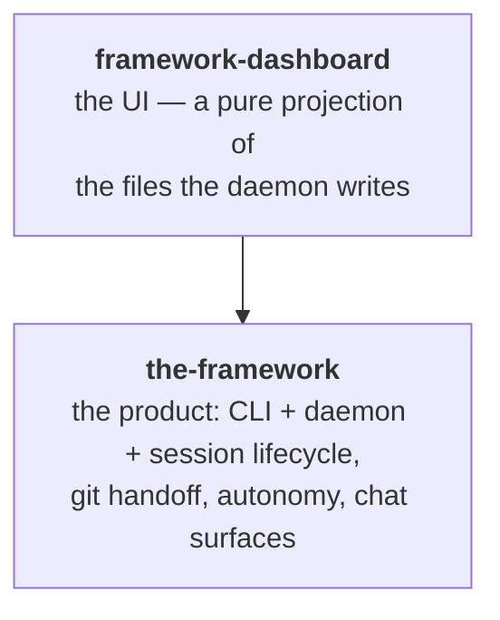

Autonomous AI programming: humans make the important decisions while The Framework runs coding agents unattended — planning its own work, spending idle subscription quota on the roadmap, and handing everything off as pull requests for review.

## TLDR

- The product is a local daemon plus a dashboard. You register your repos, and from then on coding agents (Claude Code today, others behind the same seam) work on them in sessions: each session gets a throwaway copy of the repo, does its work, and hands the result off as a pull request. Your own checkout is never touched.
- The human's job shrinks to decisions: answer the questions a session parks on, accept or reject proposed tickets, review PRs. Everything else — picking the next task, triaging, planning, fixing red CI, merging on green — the daemon does by itself when nobody is at the keyboard, as long as the account's quota allows it.
- The coding agent is a black box: The Framework prompts it, lets it run a full turn, then reads the code and the turn's final message. It never micro-manages individual tool calls, and the agent keeps its own subscription login — The Framework adds orchestration, not another AI bill.
- Two satellites complete the family: a browser extension that bridges claude.ai cloud sessions back to the daemon, and the product's website.
- The Framework develops itself: this repo's `tickets/` and `TODO_AGENTS.md` are its own roadmap and queue, worked by the very loops described here.

The arrows point one way — the dashboard renders the product — and nothing depends "up".

## Rationales

- **Files are the seam.** A session appends its events to a log file; the daemon tails it and pushes to browsers. Steering flows back through a control file the session tails. There is no direct process-to-process channel.
- **The dashboard is a projection.** It never holds authoritative state; it renders what is on disk.
- **The agent is a black box.** The Framework gates on code and outcomes, never on the agent's individual tool calls.
- **Every session runs on its own branch, in its own worktree.** The user's checkout is never the agent's workspace.
- **The daemon writes to the project checkout, the agent does not.** And when it does, it commits only the exact files it means to — the user's in-progress work can never ride along.
- **Spend the whole week's quota, never starve the user.** Unattended work stands down as spending catches up with the clock; work the user asks for always goes first.
- **Proposals vs. decisions.** Agents propose (tickets, plans, PRs); humans decide. The queue holds only confirmed work.
- **Refuse loudly, degrade quietly.** A guard that cannot be enforced is announced; a read that fails yields an empty result rather than a crash.

## Before writing SPEC.md files

Read https://raw.githubusercontent.com/brillout/sdd/refs/heads/main/sdd.md
