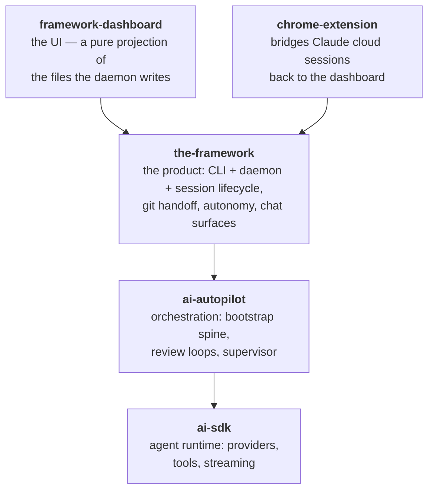

Autonomous AI programming: humans make the important decisions while The Framework runs coding agents unattended — planning its own work, spending idle subscription quota on the roadmap, and handing everything off as pull requests for review.

## TLDR

- The product is a local daemon plus a dashboard: you register your repos, and from then on coding agents (Claude Code today, others behind the same seam) work on them in sessions that each get a throwaway copy of the repo and hand their result off as a pull request.
- The human's job shrinks to decisions — answer the questions a session parks on, accept or reject proposed tickets, review PRs — while everything else the daemon does by itself when nobody is at the keyboard, as far as the account's quota allows.
- The coding agent is a black box that keeps its own subscription login: The Framework prompts it, reads the resulting code and the turn's final message, and never micro-manages individual tool calls.
- The product sits on two engines that also ship on their own: an orchestration layer (scope → build → review loops until production-grade) and an agent runtime (providers, tools, streaming).
- The Framework develops itself: this repo's `tickets/` and `TODO_AGENTS.md` are its own roadmap and queue, worked by the very loops described here.

## Flows

How the pieces relate:

One family, one rule: the arrows point one way and nothing depends "up". (`the-framework.ai` is the product's public website and sits outside the runtime.)

- **A repo's life.** You register a repo once; from then on sessions work on it — started by you, by a routine, or by the daemon's own idle sweep — and every session that produced real work ends as a pull request for you to review.
- **The human loop.** Whatever needs a person becomes a card or a notification: a question a session parked on, a proposed ticket, a PR to review. Answering steers the agent; everything else keeps moving without you.
- **The autonomous loop.** When nobody is around, the daemon drains the confirmed-work queue, refills it by triaging and planning tickets, keeps CI green on the PRs it opened, and merges them once checks pass — all bounded by the account's own quota week.

## Rationales

- **Files are the seam.** A session appends its events to a log file; the daemon tails it and pushes to browsers; steering flows back through a control file the session tails. There is no direct process-to-process channel.
- **The dashboard is a projection.** It never holds authoritative state; it renders what is on disk.
- **The agent is a black box.** The Framework gates on code and outcomes, never on the agent's individual tool calls — and the agent keeps its own subscription login, so The Framework adds orchestration, not another AI bill.
- **Every session runs on its own branch, in its own worktree.** The user's checkout is never the agent's workspace.
- **The daemon writes to the project checkout, the agent does not.** And when it does, it commits only the exact files it means to — the user's in-progress work can never ride along.
- **Spend the whole week's quota, never starve the user.** Unattended work stands down as spending catches up with the clock; work the user asks for always goes first.
- **Proposals vs. decisions.** Agents propose (tickets, plans, PRs); humans decide. The queue holds only confirmed work.
- **Refuse loudly, degrade quietly.** A guard that cannot be enforced is announced; a read that fails yields an empty result rather than a crash.

## Before writing SPEC.md files

Read https://raw.githubusercontent.com/brillout/sdd/refs/heads/main/sdd.md
