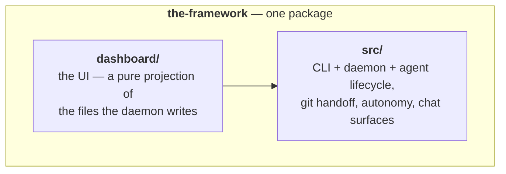

Autonomous AI programming: humans make the important decisions while The Framework runs coding agents unattended — planning its own work, spending idle subscription quota on the roadmap, and handing everything off as pull requests for review.

## User Stories

- The user activates a repo from the dashboard; from then on coding agents work on it in throwaway copies, and the user's own checkout is never touched.
- The user types a prompt or picks a preset, then watches the agent live — answering the questions it parks on, chatting with it, stopping it — or is not there at all.
- The user reviews finished work as pull requests: an agent that produced real work pushes it and opens a PR by itself.
- The user walks away and the product keeps working: it drains the confirmed queue, refills it by triaging and planning tickets, fixes red CI on its own PRs, and merges them on green.
- The user never budgets: unattended work spends only the share of the subscription week that has already elapsed, and work the user asks for is never starved.
- The user runs agents on another machine, a GitHub Actions runner, or a Claude cloud session, and steers them from the same dashboard — a browser extension bridges claude.ai cloud sessions back to it.
- The user is notified — browser or Discord — whenever an agent needs a human.

## Flows

- The product is a local daemon plus a dashboard. The user registers repos, and from then on coding agents (Claude Code today, other CLIs pluggable behind the same driver interface) work on them: each agent gets a throwaway copy of the repo, does its work, and hands the result off as a pull request.
- The human's job shrinks to decisions: answer the questions an agent parks on, accept or reject proposed tickets, review PRs. Everything else — picking the next task, triaging, planning, fixing red CI, merging on green — the daemon does by itself when nobody is at the keyboard, as long as the account's quota allows it.
- The driver is a black box: The Framework prompts it, lets it run a full turn, then reads the code and the turn's final message. It never micro-manages individual tool calls, and the CLI keeps its own subscription login — The Framework adds orchestration, not another AI bill.
- Two satellites complete the family: a browser extension that bridges claude.ai cloud sessions back to the daemon, and the product's website.
- The Framework develops itself: this repo's `tickets/` and `TODO_AGENTS.md` are its own roadmap and queue, worked by the very loops described here.

The arrow points one way — the dashboard renders the product — and nothing depends "up".

## Rationales

- **Files are the seam.** An agent appends its events to a log file; the daemon tails it and pushes to browsers. Steering flows back through a control file the agent tails. There is no direct process-to-process channel.
- **The dashboard is a projection.** It never holds authoritative state; it renders what is on disk.
- **The driver is a black box.** The Framework gates on code and outcomes, never on the CLI's individual tool calls.
- **Every agent runs on its own branch, in its own worktree.** The user's checkout is never an agent's workspace.
- **The daemon writes to the project checkout, the agent does not.** And when it does, it commits only the exact files it means to — the user's in-progress work can never ride along.
- **Spend the whole week's quota, never starve the user.** Unattended work stands down as spending catches up with the clock; work the user asks for always goes first, and nothing already running is ever interrupted to economise.
- **Proposals vs. decisions.** Agents propose (tickets, plans, PRs); humans decide. The queue holds only confirmed work.
- **Refuse loudly, degrade quietly.** A guard that cannot be enforced is announced; a read that fails yields an empty result rather than a crash.

## Before modifying/creating SPEC.md files

You must always read and respect https://raw.githubusercontent.com/brillout/sdd/refs/heads/main/sdd.md
