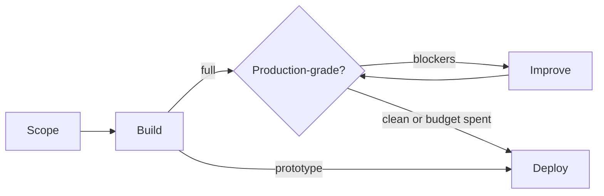

Bootstrap mode: the spine that takes a user from nothing to a running, production-grade, deployed app.

## TLDR

- One upfront question fixes the scope — quick prototype or full production app — and what to build; agents then build it, choosing the stack themselves.
- Full scope enters the full-fledged loop: a checklist reports blockers, the app is improved against them with fresh context, and the check repeats until clean or a pass budget runs out — production-grade is earned, never claimed, and prototypes skip the loop.
- The checklist can have teeth: besides asking a model, the app can be booted and probed in its workspace, and every merged check must come back clean.
- Deploy ends the flow: an agent decides how the app renders and where it ships, then a pluggable target executes the plan — plan-only by default, or for real via the Cloudflare and Dokploy adapters.
- The orchestrator owns only sequencing and narration; all real work is injected as steps, so the same flow runs with production agents or entirely offline.

## Flows

## Rationales

- Deciding a deploy is separated from executing it, and the default only decides and narrates — bootstrap must never blind-ship a fresh app.
- Real deploy adapters report failure as an outcome to narrate, not an exception — by then the app was already built, and a failed deploy must not destroy that.

## Before writing SPEC.md files

Read https://raw.githubusercontent.com/brillout/sdd/refs/heads/main/sdd.md
