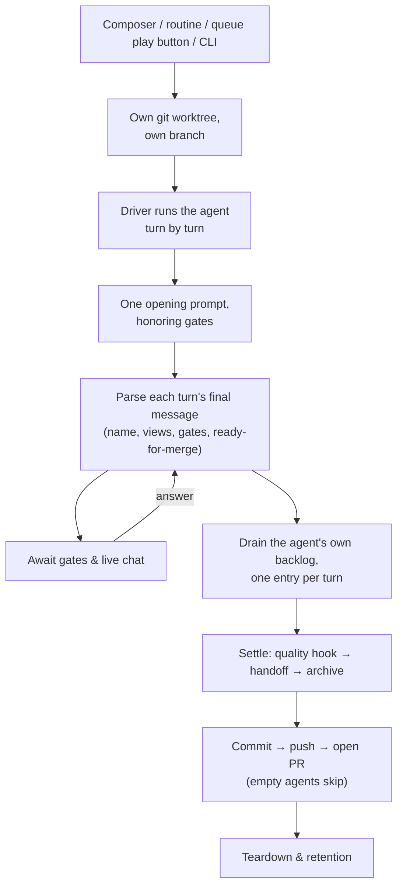

The product: turnkey AI orchestration that wraps a coding-agent CLI (Claude Code today) as a black box and takes an idea, a ticket, or a queue entry to a reviewed pull request — a CLI, a per-machine daemon, and a localhost dashboard over agents that run unattended.

## User Stories

- The user installs globally or runs via `npx`; one command serves the dashboard and the daemon, and Ctrl-C takes everything down with it.
- The user activates a repo from the dashboard and it becomes a registered project, with an onboarding checklist derived from real facts rather than clicks.
- The user starts an agent by typing a prompt (attended) or picking a preset (unattended) — from the composer, a ticket row, a queue entry, a routine, or the CLI.
- The user watches a live transcript, answers the agent's questions inline where they happened, chats with it, stops and resumes it, and reopens a finished agent as the same conversation.
- The user receives finished work as a pull request, and can arm auto-merge so it lands once the agent signals ready and checks are green.
- The user browses a cross-project ticket list, filters it, shares the filtered view as a URL, and queues or starts work from a ticket.
- The user walks away and the daemon keeps working the roadmap: draining the confirmed queue, refilling it by triaging and planning tickets, fixing red CI on its own PRs, and merging on green.
- The user sets no budget: unattended work stands down past the elapsed share of the quota week, and work the user asked for is never starved.
- The user runs agents on another machine's daemon, a GitHub Actions runner, or a Claude cloud session, and answers their questions from the local dashboard.
- The user is notified — browser or Discord — when an agent needs a human.

## Flows — TL;DR

- One daemon per machine. Running the CLI in any registered repo finds it; it serves the dashboard, spawns agents, and runs the background services (autonomy sweeps, notifications, chat, CI watch).
- An agent is one task worked in its own git worktree on its own branch. It streams what it does as events; the human can watch, answer its questions, and chat with it live — or not be there at all.
- When an agent ends with real work, the work is pushed and opened as a PR. Empty agents publish nothing.
- When nobody is around, the daemon plays product manager: it drains the confirmed-task queue, refills it by triaging and planning tickets, keeps CI green on the PRs it opened, and merges them once checks pass — all bounded by the account's own quota week.
- Which CLI drives the work is a swappable axis (the *driver*), and where it executes is another (the *location*); the CLI keeps its own subscription auth, and The Framework never runs its own model calls for the coding work.

## Flows

**Setup.** Activating a repo commits any dirty state first (so the activation commit is clean), creates the `.the-framework/` state directory, seeds the project log, teaches `.gitignore` which parts stay untracked, and registers the project in a per-machine registry in the user's home — which also holds the user's dashboard preferences (project settings override user settings, only for keys a project may override) and the daemon's secrets. Before an agent spawns anything, a preflight probes the driver CLI it picked, so a missing prerequisite fails early and clearly; a guard the picked driver cannot honor is announced rather than silently ignored.

**Start.** An agent starts from the dashboard composer, a routine's "Run now", a queue entry's play button, onboarding, or the CLI. The daemon resolves the project, allocates the workspace, guards against a busy project, and spawns the agent as a detached process. One aimed at a saved remote device is relayed to that device's daemon.

**Workspace.** Every agent gets its own git worktree on its own branch, so concurrent agents never fight and the user's checkout — uncommitted work included — is never touched. Dependency directories are shared from the parent checkout instead of reinstalled. A non-git project falls back to the main checkout, one agent at a time; a git project whose worktree creation failed does **not** fall back — the start fails, because a failed agent is recoverable and a checkout with stray edits is not.

**Driving the work.** The driver runs each turn as a black box to completion. Everything The Framework learns from a turn, it learns by parsing the turn's final message: the session name the agent invented (the branch is renamed to match), agent-authored views for the dashboard, the ready-for-merge signal, and blocking gates. A build and a verbatim prompt are the same path — one opening prompt, honoring gates; what differs is which prompt opens the agent and whether its own backlog is worked afterwards. A hands-off location (a cloud session) drops every phase after the work is dispatched, because there is nothing to read back.

**Gates and chat.** When the agent stops to ask, it parks and the question becomes a card: choices in the dashboard, a message on Discord, a notification. The answer travels back over the agent's control file and it continues from there — unless the answer is one the agent marked as ending it, which is how declining a plan stops the work rather than building on a rejected one. The human can also speak unprompted; each message continues the same conversation, and an idle attended agent stays open waiting for the next one. Unattended agents take the recommended answer instead of parking on a question nobody is there to answer.

**The agent's own backlog.** Once the main work settles, the agent drains its queue file one entry per turn — read, complete exactly one entry, check it off, repeat — with a per-entry gate that an unattended agent answers itself.

**Settle and handoff.** Settling is strictly ordered: a final quality turn (which queues the quality presets as backlog entries and folds new learnings into the project docs) → the git handoff → close and archive the agent's history. The handoff runs only on the success path and first decides whether the agent is *empty* — no commits, or only bookkeeping files changed. Empty agents are never published; otherwise pending work is committed, the branch pushed, and a PR opened. Publishing is one ladder — keep it local, push, open a PR, merge — and each rung includes the ones below it. Unset means open a pull request: that is the zero-config promise, an agent left alone publishes itself.

**Teardown and retention.** One rule decides every removal: the work is committed to the agent's branch, the branch is pushed, and the checkout goes only once the remote has it — so nothing local is ever the last copy, and every deletion is recoverable. A push that cannot land keeps the checkout, and the background sweep retries it later; a repo with nowhere to push keeps everything, which is the honest answer rather than a special case. The branch and the archived history always survive the worktree. An agent that died on a transient error is retried in the same worktree before being declared failed, and a finished one can be reopened later — its history restored so it continues as the same conversation. Acting on an agent the instant it finishes is safe: everything that touches its checkout takes its turn rather than racing, so a click that lands mid-teardown waits a beat instead of failing.

**Autonomy.** The repo-root queue file (`TODO_AGENTS.md`) is the durable, priority-ordered list of confirmed work — written directly by agents, unlike a *ticket*, which is a proposal for a human to accept. Because agents run in worktrees, the daemon promotes that one file back into the project checkout, committing only that file, and skipping with a stated reason whenever anything looks unexpected. An entry stays claimed while its agent is live or its PR is open, so parallel drains never double-assign it — the queue file itself is the record of what is left. On a timer, per project, the daemon asks one policy question — "is now a good time to spend quota on our own roadmap?" — checking the cheapest facts first. A non-empty queue is drained one entry per agent; an empty queue is refilled by rotating through quick triage → consensual triage → ticket planning. Ticket planning fans out several agents, each pinned to exactly one ticket and claimed via a lock file beside the ticket on the default branch, so agents on other machines see the claim too. A calendar-paced maintenance sweep sits outside the rotation and takes precedence when due. Every refusal is phrased as a reason, so a setting never reads as a bug.

**Merging and CI watch.** Configuration only *arms* auto-merge; what *authorizes* it is the agent's own ready-for-merge signal plus an empty backlog of its own, and an armed-but-unauthorized merge is recorded as withheld, with the reason. The daemon polls the PRs the framework is waiting to land. Green checks on an armed PR: merge it — merge-on-green works even where GitHub's native auto-merge is off. Red checks: one unattended fix agent per failing head commit, told to land the fix on the PR's own branch; after two failed attempts the failure is evidently not one an agent can fix and a human keeps it. Housekeeping retires what has landed: worktrees whose branch merged are removed, and a pinned routine branch left behind by a closed PR is released so the routine can fire again.

**Spending limits.** The whole quota policy is one line: unattended work may spend up to the pro-rated share of the account's week that has elapsed, rising continuously with the clock. Nothing to configure — the week is read from the account itself. Two properties fall out: nothing is left on the floor (the boundary reaches the full allowance exactly as the week resets), and background work cannot starve the user (unattended work stands down past the boundary). A slider moves that stand-down line — but for work the user asked for, the slider only ever *loosens* the gate, and it is re-read live, so raising it unparks a waiting agent without a restart. The two gates fail in opposite directions on purpose: no readable quota means unattended work does not start, while user-requested work carries on. The gate is on *starting*, and only on starting: an agent already going is never interrupted to economise, because by then the tokens are spent, the work is half-done, and what is saved is the cheap part while what is lost is the expensive part.

**Surfaces.** The daemon serves the dashboard and answers all its reads from the files agents write. Non-local binds demand a shared token, because a daemon that spawns processes on a reachable port is remote code execution. For a saved remote device, the local daemon — never the browser — talks to the device's daemon and streams its events back over the local origin; the device's token is saved only in the user's own browser and handed to the local daemon per call. A shared link re-serves one agent's event stream read-only, from the same daemon that owns it. An agent can also run elsewhere: on a Claude cloud session (fire-and-forget: it opens its own PR), or on GitHub Actions (dispatch, poll, read back the uploaded transcript; continuity between turns is the branch the previous turn pushed) — with a browser extension inside the user's own claude.ai tab bridging cloud sessions back, so a question a cloud agent parks on becomes a dashboard card. An agent can launch a real Chrome that both it and a watching human attach to at once; when it hits a login wall, captcha, or 2FA it parks on a gate and hands the browser over — it never types a password. On Discord, notification watchers post agent activity and what needs a human; Discord is a way out, not a way in.

**What lands in git.** One record of what happened: each agent's own event log, archived under a per-user directory keyed by the git identity, so cleaning the repo cannot erase the past and two people on one repo do not conflict. The daemon commits those archives after an idle window, only those paths, skipping while someone holds the index. Tickets — `tickets/<DATE>_<SLUG>.md`, the human-facing roadmap, with optional plan and claim siblings, parsed tolerantly. And the queue file plus a human-readable log of what The Framework did to the project.

**Prompts and presets.** One assembly path composes the system prompt for every agent — the built-in protocol, the extra protocol each capability brings, the user's own system file, and the picked context — and the exact composed text is recorded, so the dashboard can show precisely what the agent ran under. Two switches dial the wrapping down: *vanilla* drops the enhanced prompt while keeping the framework integration, and *transparent* is the master off-switch — no framework channel at all, the CLI raw. Presets (triage, research, security audit, drain-the-queue, …) are one catalog with prompt text authored as prose; custom presets save to either the user tier (follows the person, private) or the project tier (travels with the repo, shared). A per-repo config file records which preset and switches a project works under, resolved layer over layer.

## Rationales

- **One recorded PR number.** The PR number is recorded on the agent the moment one is opened, so every surface reads the same number instead of re-deriving it and disagreeing.
- **Publishing rungs nest.** Because each publishing rung includes the ones below it, a PR always implies a push — no combination of switches can contradict itself.
- **One opening path for builds and verbatim prompts.** Two orchestrators would drift apart; the only real differences are which prompt opens the agent and whether its backlog is worked afterwards.
- **Removal asks one question: is the work safe yet?** How an agent ended has several answers, and none of them bears on whether its work is recoverable.
- **The queue file is the record.** A claim reassembled at read time from agent records, PRs, and other machines' diffs can disagree with itself; the file cannot.
- **Two prompt switches, not modes.** Vanilla and transparent compose independently; a catalog of named modes multiplies instead.

## Glossary

- **driver** — the coding-agent CLI that does the work (Claude Code today, Codex too); swappable per agent.
- **location** — where an agent executes: the local machine, a saved remote device, a GitHub Actions runner, or a Claude cloud session.
- **attended / unattended** — whether a human is expected at the keyboard: an attended agent parks on its questions; an unattended one takes the recommended answer and carries on.
- **gate** — a question an agent parks on, shaped as options; an option can be marked to stop the agent rather than resume it.
- **ticket** — a proposal for a human to accept, kept as a file under `tickets/`.
- **queue entry** — one item of confirmed work in the repo-root queue file `TODO_AGENTS.md`.
- **empty agent** — an agent whose run left no commits (or only bookkeeping changes); it publishes nothing.
- **preset** — a cataloged prompt that starts an unattended agent (triage, research, security audit, …).

## Before modifying/creating SPEC.md files

You must always read and respect https://raw.githubusercontent.com/brillout/sdd/refs/heads/main/sdd.md
