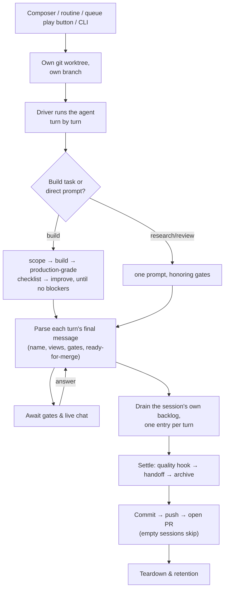

The product: turnkey AI orchestration that wraps a coding-agent CLI (Claude Code today) as a black box and takes an idea, a ticket, or a queue entry to a reviewed pull request — a CLI, a per-machine daemon, and a localhost dashboard over sessions that run unattended.

## TLDR

- One daemon per machine: running the CLI in any registered repo finds it, and it serves the dashboard, spawns sessions, and runs the background services (autonomy sweeps, notifications, chat, CI watch).
- A session is one agent working one task in its own git worktree on its own branch, streaming what it does as events; the human can watch, answer its questions, and chat with it live — or not be there at all.
- A session that ends with real work is pushed and opened as a PR; empty sessions publish nothing, and no PR number is ever stored — every surface re-resolves the PR live from the session's branch.
- When nobody is around, the daemon plays product manager: it drains the confirmed-task queue, refills it by triaging and planning tickets, keeps CI green on the PRs it opened, and merges them once checks pass — bounded by the account's own quota week.
- The agent stays swappable behind a driver seam and keeps its own subscription auth; The Framework never runs its own model calls for the coding work.

## Flows

A session, from start to merge:

- **Setup.** Activating a repo commits any dirty state first, creates the `.the-framework/` state directory, seeds the project log, teaches `.gitignore` which parts stay untracked, and registers the project in a per-machine registry in the user's home — the same registry that holds the user's dashboard preferences (project settings override user settings, only for keys a project may override) and the daemon's secrets. Optionally the daemon scans one designated directory on boot and auto-registers every git repo in it.
- **Preflight.** Before a session spawns anything, a preflight probes the agent CLI the session actually picked, so a missing prerequisite fails early and clearly.
- **Start.** A session starts from the dashboard composer, a routine's "Run now", a queue entry's play button, onboarding, or the CLI; the daemon resolves the project, allocates the workspace, guards against a busy project, and spawns the session as a detached process. A session aimed at a saved remote device is relayed to that device's daemon instead; a "topic" session (no project yet) starts in a neutral scratch directory and re-homes into a project once the conversation binds one.
- **Workspace.** Every session gets its own git worktree on its own branch; dependency directories are shared from the parent checkout instead of reinstalled. A non-git project falls back to the main checkout, one session at a time.
- **Driving the agent.** The driver runs each agent turn as a black box to completion; everything The Framework learns from a turn, it learns by parsing the turn's final message — the session name the agent invented (the branch is renamed to match), agent-authored views for the dashboard, the ready-for-merge signal, and blocking gates. The protocol for these signals is appended to the system prompt at runtime.
- **Build vs. direct prompt.** A build task runs the full spine — scope, build, then a production-grade checklist repeated against its list of blockers until none remain, optionally including actually booting the app to prove it serves. A research- or review-shaped task runs as one prompt that honors gates, with no build scaffolding. A hands-off target (a cloud session) drops every phase after the work is dispatched.
- **Gates and chat.** When the agent stops to ask, the session parks and the question becomes a card: choices in the dashboard, a message on Discord, a notification. The answer travels back over the session's control file and the agent continues from it. The human can also speak unprompted; each message continues the same agent conversation, and an idle attended session stays open waiting for the next one. Unattended sessions disable gates entirely and end when the work does.
- **The session's own backlog.** Once the main work settles, the session drains the queue file one entry per turn — read, complete exactly one entry, check it off, repeat — with a per-entry gate that autopilot auto-accepts.
- **Settle and handoff.** Settling is strictly ordered: a final quality turn (which queues the quality presets as backlog entries rather than running them, and folds new learnings into the project docs) → the git handoff → close and archive the session history. The handoff runs only on the success path and first decides whether the session is *empty* — no commits, or only bookkeeping files changed; empty sessions are never published, otherwise pending work is committed, the branch pushed, and a PR opened.
- **Teardown and retention.** A session that finished cleanly has its worktree removed; one that failed or was stopped keeps its checkout. The branch and the archived session history always survive the worktree. A session that died on a transient error (connection drop, rate limit) is retried in the same worktree before being declared failed, and a finished session can be reopened later — its history restored so it continues as the same conversation. Acting on a session the instant it finishes is safe: everything that touches that session's checkout takes its turn rather than racing, so a click that lands mid-teardown (a resume included) waits a beat instead of failing.
- **The queue.** The repo-root queue file (`TODO_AGENTS.md`) is the durable, priority-ordered list of confirmed work — written directly by sessions, unlike a *ticket*, which is a proposal for a human to accept. The daemon promotes a session's queue edits back into the project checkout, committing only that one file, and skipping with a stated reason whenever anything looks unexpected. An entry stays claimed while its session is live or its PR is open.
- **The idle sweep.** On a timer, per project, the daemon asks one policy question — "is now a good time to spend quota on our own roadmap?" — checking the cheapest facts first: feature on? concurrency free? cooldown elapsed? queue readable? quota headroom left? Then: a non-empty queue is drained one entry per session; an empty queue is refilled by rotating through quick triage → consensual triage → ticket planning. Ticket planning fans out several agents, each pinned to exactly one ticket and claimed via a lock file beside the ticket on the default branch. A calendar-paced maintenance sweep (review the commits each repo grew since its last review) sits outside the rotation and takes precedence when due.
- **Merging and CI watch.** Configuration only *arms* auto-merge; what *authorizes* it is the agent's own ready-for-merge signal plus an empty session backlog, and an armed-but-unauthorized merge is recorded as withheld, with the reason. The daemon polls the PRs the framework is waiting to land: green checks on an armed PR merge it — merge-on-green works even where GitHub's native auto-merge is off; red checks start one unattended fix session per failing head commit, told to land the fix on the PR's own branch, and after two failed attempts a human keeps it. Housekeeping sweeps retire what has landed: worktrees whose branch merged are removed, and a pinned routine branch left behind by a closed PR is released so the routine can fire again.
- **Spending limits.** The whole quota policy is one line: unattended work may spend up to the pro-rated share of the account's week that has elapsed, rising continuously with the clock — nothing to configure, the week is read from the account itself. A slider moves that stand-down line either side of the boundary, and it is re-read live, so raising it unparks a waiting session without a restart. Inside a run, a consumption guard polls the account and aborts the session when the limit is crossed.
- **Dashboard serving.** The daemon serves the dashboard and answers all its reads from the files sessions write. For a saved remote device, the local daemon — never the browser — talks to the device's daemon and streams its events back over the local origin.
- **Sharing.** A hosted relay ingests a session's event stream and re-serves the same dashboard read-only to anyone with the URL, so two people on different machines watch one session live.
- **Elsewhere targets.** A session can run on a Claude cloud session (fire-and-forget: it opens its own PR and the local run ends with the link) or on GitHub Actions (dispatch, poll, read back the uploaded transcript; continuity between turns is the branch the previous turn pushed). A browser extension inside the user's own claude.ai tab bridges cloud sessions back: a question a cloud run parks on becomes a dashboard card, and the picked answer travels back for the extension to deliver.
- **The browser.** A session can launch a real Chrome that both the agent and a watching human attach to at once: the dashboard shows a live screencast and forwards clicks and keys, and when the agent hits a login wall, captcha, or 2FA it parks on a gate and hands the browser to the human — the agent never types a password.
- **App preview.** One click boots the project's app (its dev script when it has one, else a static server) to *show* it — the decoupled twin of the serve check, which boots it to *verify* it. A session can preview its own worktree; the preview stops before that worktree is removed.
- **Discord.** Outbound, two notification watchers — session activity, and what needs a human — each posting only *new* items to a webhook. Inbound, a chatbot: a channel message answers a parked question, steers a live session, or starts one, through the same control channel a dashboard click uses; a reply mirror posts the session's answers back to the channel that asked.
- **What lands in git.** Conversations (each session's human turns and agent replies, one file per session); session history (finished sessions archived under a per-user directory); tickets (`tickets/<DATE>_<SLUG>.md`, the human-facing roadmap, with optional plan and claim siblings, parsed tolerantly); the queue file; and a human-readable project log of what The Framework did.
- **Prompts and presets.** One assembly path composes the system prompt for every session — the built-in protocol, the extra protocol each of the session's capabilities brings, the user's own system file, and the picked context — and the exact composed text is recorded, so the dashboard can show precisely what the agent ran under. Modes dial the wrapping down: *vanilla* drops the built-in enhanced prompt while keeping the framework integration; *transparent* is the master off-switch — no framework channel at all; *eco* trims the prompt's automatic behaviors one by one. Presets (triage, research, security audit, drain-the-queue, …) are one catalog with prompt text authored as prose; custom presets save to either the user tier (follows the person, private) or the project tier (travels with the repo, shared). A per-repo config file records which domain preset and modes a project builds under, resolved layer over layer so a project overrides only what it actually sets.

## Rationales

- Activation commits dirty state first so the activation commit itself is clean.
- A guard the picked agent cannot honor (e.g. a cost cap on an agent that reports no price) is announced rather than silently ignored.
- A git project whose worktree creation failed does **not** fall back to the main checkout — the session fails, because a failed session is recoverable and a checkout with stray agent edits is not.
- Sharing dependency directories from the parent checkout makes workspaces instant and costs no extra disk.
- Unattended sessions disable gates because nobody is there to answer.
- A hands-off target drops every phase after dispatch because there is nothing to read back — and the driver flags itself hands-off so later phases don't mistake its own summary for the agent's answer.
- Empty sessions are never published; both handoff halves default on — that is the zero-config promise: a session left alone publishes itself. They form a ladder, not a pair: pushing is the rung under the PR, so turning push off publishes nothing, and "PR without push" is not a state a session can be asked for.
- A failed or stopped session keeps its worktree because that is exactly when you want to inspect the half-finished tree.
- No PR number is ever stored; every surface re-resolves the PR live from the session's branch, so state can never disagree with GitHub.
- The queue must be promoted back to the project checkout because sessions run in worktrees — their queue edits would land on a branch nobody reads.
- Claimed queue entries keep parallel drains from double-assigning work.
- Ticket claims live in lock files beside the ticket on the default branch so agents on other machines and cloud sessions see the claim too.
- Every autonomy refusal is phrased as a reason, so a setting never reads as a bug.
- Arming and authorizing a merge are separate on purpose: configuration can only ever *allow* a merge, and the agent's own ready-for-merge signal is what makes it happen — a withheld merge records why.
- After two failed CI-fix attempts the failure is evidently not agent-shaped, so a human keeps it.
- Two properties fall out of the pro-rated quota boundary: nothing is left on the floor (the boundary reaches the full allowance exactly as the week resets), and background work cannot starve the user (their work borrows against days to come).
- For work the user asked for, the spend slider only ever *loosens* the gate — the user outranks their own safety margin.
- The two quota gates fail in opposite directions on purpose: no readable quota means unattended work does not start, while user-requested work carries on — with the per-session cost cap still underneath it.
- Quota reads are expensive (they spawn the whole agent CLI), so polling is deliberately slow — the boundary moves over days.
- Non-local dashboard binds demand a shared token, because a daemon that spawns processes on a reachable port is remote code execution.
- A remote device's token is saved only in the user's own browser and handed to the local daemon per call, never persisted by it.
- The browser proxy takes the session's port from the session's own record, never from the client, so the proxy cannot be aimed at anything else.
- Conversations land one file per session because concurrent sessions would conflict on a shared file — and they are deliberately not the verbose tool-call transcript: what lands is what a person would reread.
- The daemon commits main-checkout conversations only after an idle window, only the conversation files, never the user's in-progress work — and skips entirely while someone else is mid-rebase or holds the index.
- Tickets are parsed tolerantly so imported tickets that predate the format still list.

## Before writing SPEC.md files

Read https://raw.githubusercontent.com/brillout/sdd/refs/heads/main/sdd.md
