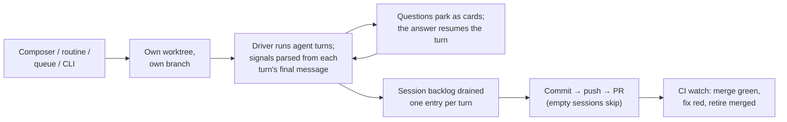

The engine of The Framework: everything that turns an idea, a ticket, or a queue entry into a reviewed pull request — the CLI, the per-machine daemon, the session runtime that drives the wrapped coding agent, and the surfaces that watch and steer it.

## TLDR

- One daemon per machine spawns and tracks sessions, serves the localhost dashboard, and runs the background services (autonomy sweeps, CI watch, notifications, chat). Files are the seam: sessions narrate onto an on-disk event stream, steering comes back over an append-only control file, and the dashboard is a projection of what sessions wrote — never a live wire into them.
- A session is one agent working one task in its own git worktree on its own branch. The agent (Claude Code today) stays a swappable black box behind the driver seam; everything the framework learns from a turn — ask-gates, views, the session name, ready-for-merge — is parsed as tagged blocks out of the turn's final message.
- One composition path assembles every session's system channel (project context and knowledge docs, built-in prompt, the user's own instructions, the emit protocols), so the dashboard can show exactly what the agent ran under; vanilla, transparent, and eco modes dial the wrapping down.
- A session that ends with real work publishes itself — commit, push, open a PR; empty sessions publish nothing, and merging is authorized by the agent's own ready signal plus an empty session backlog, never by configuration alone.
- When nobody is around, the daemon plays product manager bounded by the account's own quota week: drain the confirmed queue, refill it by triaging and planning tickets (claims committed as lock files beside the tickets, so other machines and cloud sessions see them), keep CI green on the PRs it opened, and merge on green.
- What must outlive a process lands in git, not memory: session history (per user, so a repo clean cannot erase it and teammates never conflict), conversations, tickets and their claims, the queue, and the project log.
- The subdirectories hold the seams: the agent adapters (driver), the on-disk run state (store), the dashboard and its RPC contract, the Discord bridge, and the end-to-end proofs.

## Flows

- A build session runs the spine — build, then the opted-into preset's review loop against its blockers until none remain, optionally proving the app really boots and serves (in a throwaway sandbox if asked); a research- or review-shaped prompt runs as a single gated turn instead.
- When the agent stops to ask, the question becomes a card on every surface and the picked answer re-prompts the same session; unattended sessions disable gates, and hands-off sessions are told up front the gates are unavailable so they never park on a question nobody can answer.
- Unattended spending stands down past the pro-rated share of the account's week that has elapsed; work the user asked for carries on, with the per-session cost cap still underneath.

## Rationales

- Worktrees exist so concurrent sessions never fight and the user's checkout — uncommitted work included — is never touched; a checkout retained after a failure is kept precisely because it holds the uncommitted diff worth inspecting, so cleanup commits that work before removing anything.
- The agent is treated as a black box on purpose: the framework never runs its own model calls for the coding work, reviews only what the user opted into or what is mechanically checkable, and swapping the agent means swapping one driver.

## Before writing SPEC.md files

Read https://raw.githubusercontent.com/brillout/sdd/refs/heads/main/sdd.md
