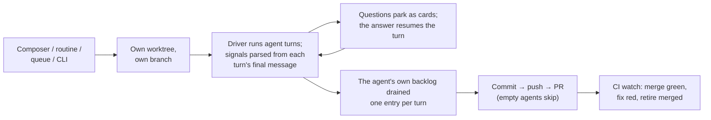

The engine of The Framework: everything that turns an idea, a ticket, or a queue entry into a reviewed pull request — the CLI, the per-machine daemon, the agent runtime that drives the wrapped coding-agent CLI, and the surfaces that watch and steer it.

## User Stories

- The user starts an agent from a prompt, a preset, a ticket, or a queue entry, and gets the finished work back as a pull request — their own checkout untouched.
- The user watches a live agent, answers the question it parked on, and chats with it mid-run.
- The user leaves the keyboard and comes back to a drained queue, freshly triaged and planned tickets, and green pull requests merged — paid for with the account's leftover quota.

## Flows

- One daemon per machine spawns and tracks agents, serves the localhost dashboard, and runs the background services (autonomy sweeps, CI watch, notifications, chat) on one shared clock rather than a timer apiece. Files are the seam: agents narrate onto an on-disk event stream, steering comes back over an append-only control file, and the dashboard is a projection of what they wrote — never a live wire into them.
- An agent is one task worked in its own git worktree on its own branch. The CLI behind it (Claude Code today) stays a swappable black box behind the driver seam; everything the framework learns from a turn — ask-gates, views, the session name, ready-for-merge — is parsed as tagged blocks out of the turn's final message, and a single gate block carries every kind of question.
- A build and a verbatim prompt are one path: an opening prompt that honors gates, differing only in which prompt opens it and whether the agent's own backlog is worked afterwards. Nothing reviews the work — the agent is a black box and its turn is the whole of it.
- When the agent stops to ask, the question becomes a card on every surface and the picked answer re-prompts the same conversation — unless the agent marked that answer as one that ends it, which is how a declined plan stops the work rather than building on a rejection. An unattended agent takes the recommended option, and a hands-off one is told up front the gates are unavailable so it never parks on a question nobody can answer.
- One composition path assembles every agent's system channel (project context and knowledge docs, built-in prompt, the user's own instructions, the emit protocols), so the dashboard can show exactly what the agent ran under; two switches dial the wrapping down — vanilla drops the built-in prompt, transparent empties the channel entirely.
- An agent that ends with real work publishes itself — commit, push, open a PR; empty ones publish nothing, and merging is authorized by the agent's own ready signal plus an empty backlog of its own, never by configuration alone. How far it publishes is one ordinal, not a set of switches, so an impossible combination cannot be represented.
- When nobody is around, the daemon plays product manager bounded by the account's own quota week: drain the confirmed queue, refill it by triaging and planning tickets (claims committed as lock files beside the tickets, so other machines and cloud agents see them), keep CI green on the PRs it opened, and merge on green.
- Unattended spending stands down past the pro-rated share of the account's week that has elapsed; work the user asked for carries on. The gate is on starting and only on starting — an agent already going is never interrupted to economise.
- What must outlive a process lands in git, not memory: each agent's own event log, archived per user so a repo clean cannot erase it and teammates never conflict, plus tickets and their claims, the queue, and the project log.
- The subdirectories hold the seams: the CLI adapters (driver), the on-disk agent state (store), the dashboard and its RPC contract, and the end-to-end proofs.

## Rationales

- Worktrees exist so concurrent agents never fight and the user's checkout — uncommitted work included — is never touched; one retention rule decides every removal, and it asks whether the work is on the remote rather than how the agent ended, so cleanup commits and pushes before removing anything and every deletion is recoverable.
- The CLI is treated as a black box on purpose: the framework never runs its own model calls for the coding work, and swapping which CLI does the work means swapping one driver.

## Before modifying/creating SPEC.md files

You must always read and respect https://raw.githubusercontent.com/brillout/sdd/refs/heads/main/sdd.md
