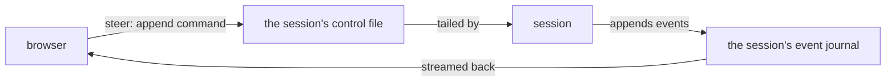

The browser's call surface: every dashboard read and write arrives here, and steering a session means appending a command to that session's own control file — the same append no matter who asked (a dashboard click, a Discord message, a remote device).

## TLDR

- Reads are thin projections of the files sessions and the daemon already write. Live events stream over one channel per session, tailing that session's own journal — and when teardown archives the journal mid-stream, the stream follows it and delivers exactly what it had not yet shown, once.
- Writes are commands — stop, answer a choice, send a message, arm the handoff, push, open a PR, merge, start a session, queue a ticket — appended to the target session's control file; there is no direct channel into the running process. (A Claude web session has none: its answer is queued for the browser extension to type in.)
- Two routing decisions live here and nowhere else: which checkout a session-scoped call resolves to (the session's own, else the project root), and whether the call is local or belongs to a session relayed to a connected device — forwarded there against a deliberate allowlist that swaps in the device's own home project.
- One surface, many hosts: the daemon, the per-project foreground dashboard, and the public relay each declare what they wire (preview, preferences, secrets, quota, the background PM), and every call degrades gracefully where a capability is absent — a shared host never holds one user's secrets.

## Flows

## Rationales

- Files are the seam on purpose: the dashboard shares no process with a session, so steering and watching both travel through files the session already owns — which is why Discord and remote devices steer a session exactly the way a dashboard click does.

## Before writing SPEC.md files

Read https://raw.githubusercontent.com/brillout/sdd/refs/heads/main/sdd.md
