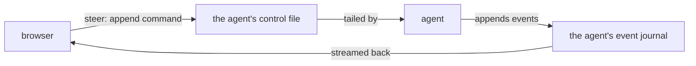

The browser's call surface: every dashboard read and write arrives here as a plain HTTP call, and steering an agent means appending a command to that agent's own control file — the same append no matter who asked (a dashboard click, a remote device).

## User Stories

- The user watches any agent's transcript live and never misses its ending.
- The user steers a live agent — stops it, answers its question, messages it, arms its handoff — and the agent reacts.
- The user publishes a finished agent's work and starts new agents without leaving the dashboard.
- The user watches and steers an agent running on a saved remote device exactly like one running here.

## Flows

- Everything the user looks at is a thin projection of files the agents and the daemon already write, called by name over plain HTTP.
- Watching an agent is one live subscription, tailing that agent's own journal — and when teardown archives the journal mid-stream, the stream follows it and delivers exactly what it had not yet shown, once.
- When the user steers a live agent — stop, answer a choice, send a message, arm the handoff — the write is a command appended to the target agent's control file; there is no direct channel into the running process. (A Claude web session has none: its answer is queued for the browser extension to type in.)
- The other writes act directly: push, open a PR, and merge run the git handoff on the agent's branch, while starting an agent and queueing a ticket go through the daemon's own wiring.
- Two routing decisions live here and nowhere else: which checkout an agent-scoped call resolves to (the agent's own, else the project root), and whether the agent a call names is local or relayed to a connected device — a relayed one's call is forwarded there, against a deliberate allowlist that swaps in the device's own home project.
- One surface, one host. The daemon wires every capability at start-up and the calls read it as simply there; an unwired one is a bug that says which field is missing, not a degraded mode to render around.

## Rationales

- Files are the seam on purpose: the dashboard shares no process with an agent, so steering and watching both travel through files the agent already owns — which is why a remote device steers an agent exactly the way a dashboard click does.

## Before modifying/creating SPEC.md files

You must always read and respect https://raw.githubusercontent.com/brillout/sdd/refs/heads/main/sdd.md
