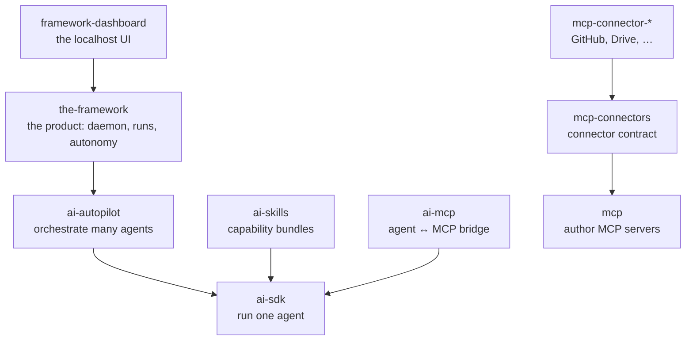

The Framework turns coding agents into autonomous workers: you queue work and make the important decisions; agents do the rest and hand you finished pull requests.

## TLDR

How the product works, end to end:

- You describe work — a typed prompt, a ticket, a queue entry. A per-machine daemon picks it up: immediately when you ask, or on its own while you're away.
- Each task runs a coding agent (Claude Code, Codex, …) as a **black box** in its own git worktree and branch: the framework prompts it, lets the agent's own loop run to completion, reads the code it produced, and judges **outcomes** (does it build, does it serve, does a review pass) — never the agent's inner steps.
- The agent's final message is the conversation protocol: it names the session, asks blocking questions (pick an option, confirm, "take over the browser for this login"), and signals when the work is ready to merge. A question parks the run; your answer — a dashboard click or a Discord reply — resumes it.
- When work settles, quality passes are queued, the branch is pushed, and a draft PR opens. If you armed it, the PR merges once CI is green. Runs that produced nothing are never published.
- Autonomy is a loop over a durable backlog: agents write their own queue (`TODO_AGENTS.md`) and drain it one entry per turn; when it runs empty and nobody is at the keyboard, an idle sweep refills it (triage tickets, plan work, maintenance). All unattended work is paced by a spending boundary — it may only spend the share of the weekly quota that has already elapsed, so it can never starve you.
- Everything you watch is a projection of files the runs write (the dashboard, Discord notifications, the shared watch-a-run relay); steering flows back through files too. There is no direct wiring between a run and the daemon.

The product is the top of a stack of reusable engines — each package's own `spec.md` tells its story; this file only says how they relate:

## Problems

- Coding agents are capable but cannot be left alone naively: they stall on decisions they shouldn't make, and they never come back to ask. The product's whole shape is the answer — let them run, and surface the *few* decisions that matter (questions, merge authorization) to a human who is mostly away.
- Agents offer no API into their loop: prompts go in, code and a final message come out. So trust is built on outcomes, and "talking to a running agent" has to be reconstructed on top of that seam (parked questions, resumable sessions).
- Many agents on one repository would trample each other and the user's own checkout — every run is isolated in its own worktree, and only the daemon writes shared state back.
- Unattended agents spend a real, shared, weekly quota — autonomy is throttled so the human's own work always has headroom.

## Decisions

- **Engines, not bindings.** The layers under the product are framework-agnostic and useful standalone; dependencies point strictly downward (`the-framework` → `ai-autopilot` → `ai-sdk`; connectors → `mcp`; never up or across).
- **The repo runs itself.** `TODO_AGENTS.md`, `tickets/`, and `.the-framework/` here are the product's own live data: the queue, roadmap, and session history of the agents that develop this codebase.

## Before modifying this file

Read this file's format at https://raw.githubusercontent.com/brillout/sdd/refs/heads/main/sdd.md
