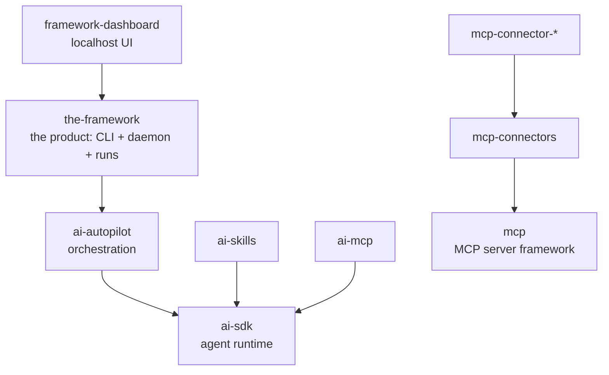

GemStack monorepo: **The Framework** — an autonomous AI programming product — together with the framework-agnostic AI and MCP engine packages it is built on.

## TLDR

- The product turns coding agents (Claude Code, Codex, …) into autonomous workers: queue work, let agents run unattended in isolated git worktrees, surface the few decisions that need a human, and hand finished work off as branches and pull requests.
- Four layers, top to bottom:
  - **Product** — `packages/the-framework` (CLI + daemon + run lifecycle) with `packages/framework-dashboard` (the localhost UI it serves).
  - **Orchestration engines** — `packages/ai-autopilot` (multi-agent orchestration) on `packages/ai-sdk` (the agent runtime), plus `packages/ai-skills` (capability bundles) and `packages/ai-mcp` (agent ↔ MCP bridge).
  - **MCP** — `packages/mcp` (author MCP servers) and `packages/mcp-connectors` + `packages/mcp-connector-*` (wire external services in as MCP tools).
  - **Site** — `packages/the-framework.ai` (marketing site).
- Each `packages/*/spec.md` describes its package; this file only says how they fit together.

## Problems

- Coding-agent CLIs offer no stable API into their loop — the product can only prompt them and read back code and final messages. Everything is designed around that black-box constraint.
- Many agents working one repository at once would trample each other and the user's own checkout — solved by giving every run its own git worktree and branch.
- Unattended agents spend a real (weekly, subscription) quota — solved by a spending boundary that rises with the clock, so autonomy never starves the human.

## Decisions

- **Engines, not bindings.** GemStack hosts framework-agnostic engines only; framework-specific bindings live with their framework. The `ai-` prefix means "depends on the agent runtime"; dependencies point one way (`ai-skills`/`ai-autopilot`/`ai-mcp` → `ai-sdk`; connectors → `mcp`; never up).
- **Files are the seam.** A run appends events to a log file; the daemon tails it; steering flows back through another file. No process-to-process IPC, and the dashboard is a pure projection of what is on disk.
- The repo dogfoods its own product: `.the-framework/` (session logs and archives), `TODO_AGENTS.md` (the AI work queue), and `tickets/` (the human roadmap, imported from GitHub issues) are live product data, not documentation.

## Facts

- Two root documents complement the `spec.md` tree: `Architecture.md` (why the package boundaries are where they are, and the design record of the AI family) and `FEATURES.md` (per-feature behavior with test recipes).
- Monorepo mechanics: pnpm workspaces (`packages/*`, `examples/*`) + Turborepo; releases via changesets (merge to `main` → version PR → publish). `.github/workflows/` carries CI, release, website deploy, a prompt-drift guard, and the agent workflow that GitHub-Actions-target runs dispatch.
- `examples/` holds five runnable offline quickstarts (one per engine seam) and `experiments/` holds a benchmark artifact — no specs there. `spike/cc-web-extension` (the claude.ai ↔ daemon bridge extension) is real product surface kept outside the workspace globs; it has its own spec.

## Before modifying this file

Read this file's format at https://raw.githubusercontent.com/brillout/sdd/refs/heads/main/sdd.md
